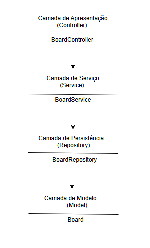

🌐 Diagrama de Arquitetura em Camadas – Projeto Java "Board"

O projeto foi desenvolvido seguindo as orientações do 
José Luiz Abreu Cardoso Junior
Desenvolvedor Backend Kotlin Sênior.

Após terminar o projeto eu desenhei a arquitetura para ficar mais visivel o que o projeto faz.

